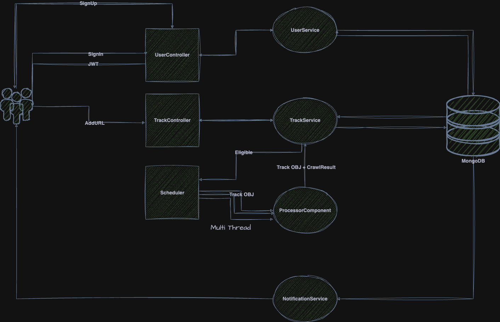

## Introduction
The Digikala Marketplace Product Price Tracker is a Java-based monolithic application built using Spring Boot 3. It is designed to crawl product pages on Digikala marketplace at configurable time intervals, track price changes, and notify users via Gmail when price changes occur. The application uses MongoDB as its database to store product information and price change history.
## Architecture Overview
The application follows a modular architecture, with each component responsible for a specific set of functionalities. The components are loosely coupled to allow for flexibility and scalability. Here is an overview of the interactions between the components:
- Users authenticate and interact with the Track component to specify product URLs for tracking.
- The Process component periodically retrieves product data from Digikala using web scraping techniques.
- Track component updates the product states in the MongoDB database and detects price changes.
- When a price change is detected, the Notification record will add to database and delegated notification scheduler is watching to send new arrivals.

## Architecture Design
<h1 align="center">
    
</h1>

## 1. User Component
The User component is responsible for handling user authentication and access level control. It provides the necessary services for user registration, login, and authentication using JWT tokens. Access levels control the user's permissions and determine which actions they can perform within the application.

### Technologies and Modules:
- Spring Security: For user authentication and access control.
- JWT (JSON Web Tokens): For secure token-based authentication.
- User Data Store: Stores encrypted user password.

## 2. Track Component
The Track component allows users to specify product URLs they want to monitor for price changes. Users can submit URLs for tracking. This component is responsible for managing the list of tracked products and their associated parameters.

### Technologies and Modules:
- MongoDB: Stores information about tracked products and their parameters.
- RESTful API: Handles user requests for tracking.
- User Authentication: Ensures that only authorized users can track products.

## 3. Process Component
The Process component is the core of the application. It is responsible for scheduling, crawling, parsing, and updating product states based on price changes. This component uses multithreading to efficiently handle a large number of product URLs concurrently. It operates based on a predefined schedule and periodically checks the tracked products for price changes.

### Technologies and Modules:
- Scheduler: Executes tasks at defined intervals.
- Multithreading: Allows concurrent processing of multiple product URLs.
- Web Scraping: Retrieves product data from Digikala.
- Data Parsing: Extracts price information from JSON responses.
- Database Interaction: Updates product states in the MongoDB database.

## 4. Notification Component
The Notification component serves as an abstract layer for user notifications. In the current implementation, Gmail notification is provided as a sample. However, this component is designed to support various notification methods, such as email, SMS, or push notifications, in the future. It triggers notifications when price changes are detected for tracked products.

### Technologies and Modules:
- Notification Service: Sends notifications to users.
- Gmail Integration (Sample): Sends email notifications using Gmail's SMTP server.
- Extendable: Designed to accommodate various notification channels.

## Features

- Crawls Digikala product pages based on configurable parameters.
- Monitors price changes for tracked products.
- Notifies users by sending emails via Gmail when price changes are detected.
- Supports JWT token generation for authentication.
- Utilizes a fake user agent for web crawling.
- Provides extensive configuration options via `config.properties` and `application.properties` files.

## Configuration

### `config.properties`

The `config.properties` file contains the following parameters:

- **`config.jwtSecret`**: Secret used for JWT token generation.
- **`config.jwtExpirationMs`**: JWT token expiration period in milliseconds (24 hours).
- **`config.dgkp.url`**: Base URL for Digikala product pages. It uses `%s` as a placeholder for the product ID.
- **`config.user.agent`**: Fake user agent used for web crawling.
- **`config.crawl.interval.ms`**: Intervals in milliseconds between two consecutive crawls (default: 5 minutes).
- **`config.max.concurrency`**: Maximum concurrency used for both the maximum executor pool size and fetch eligible tracks pagination.
- **`config.notification.eligible.page.size`**: Maximum fetch eligible notification to send page size.
- **`config.notification.scheduler.rate.ms`**: Notification scheduler fixed rate in milliseconds.
- **`config.process.scheduler.rate.ms`**: Process scheduler fixed rate in milliseconds.

### `application.properties`

The `application.properties` file contains the following properties related to the application and email configuration:

- **`spring.data.mongodb.database`**: MongoDB database name.
- **`spring.mail.host`**: SMTP host for sending emails (Gmail in this case).
- **`spring.mail.port`**: SMTP port for email communication.
- **`spring.mail.username`**: Your Gmail username for authentication.
- **`spring.mail.password`**: Your Gmail password for authentication.
- **`spring.mail.properties.mail.smtp.auth`**: Set to `true` to enable SMTP authentication.
- **`spring.mail.properties.mail.smtp.starttls.enable`**: Set to `true` to enable STARTTLS for secure email communication.

## Getting Started

1. Clone the repository to your local machine.
2. Configure the `config.properties` and `application.properties` files with your specific settings.
3. Build the application using Maven.
4. Run the application.
5. Check [Swagger documentation](http://localhost:8080/swagger-ui.html) for REST API details.

## Contributors

- Mehmaj

## License

This project is licensed under the [MIT License](LICENSE).
